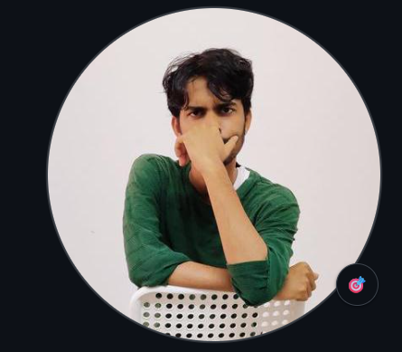

<table>
<tr>
<td width="220" valign="top" align="center">



### Rohit
<sub>@Lamronn</sub>


</td>
<td valign="top">

```

lamronn@webgo
─────────────────────────────────────────
        .-------.
       /  o   o  \        OS........: WebGo Founder
      |     ^     |       Role......: AI Developer
      |   \___/   |       Role......: Full-Stack Web Developer
       \_________/        Education.: BCA (AI & ML)
      /|    |    |\
     ( |    |    | )
       |    |    |
      / \  / \  / \
─────────────────────────────────────────
Languages.Programming: Python, JavaScript, C
Languages.Markup.....: HTML, CSS
Frameworks...........: React, Node.js, Flask, Django
Tools................: Git, Docker
─────────────────────────────────────────
Email................: rohitlamani2017@gmail.com
LinkedIn.............: linkedin.com/in/rohit-lamani
─────────────────────────────────────────

```

</td>
</tr>
</table>

---

### About Me

- 🎓 BCA (AI & ML) Student
- 🚀 Founder of WebGo
- 🔭 Currently exploring AI, Machine Learning, Cloud Computing, and Full-Stack Development

---

<div align="center">


</div>
